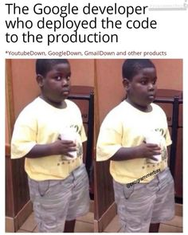

Table of Contents
- [About Me](#about-me)
- [My favorite programming Languages](#my-favorite-programming-languages)
- [Meme](#meme)

# About Me
I am Hritik Bharucha and I was born and raised in **San Diego, California**

I can program a *Hello World* function in Python.
> Talk is cheap. Show me the code – Linus Torvalds

```
def print_hello_world:
    print("Hello World")
```

My [github](https://github.com/hritikbharucha) shows more of my work.

Goals:
- [x] Write a Hello World function
- [ ] Make a revolutionary product
- [ ] Become a billionaire

I like to:
* Code
* Workout
* Play basketball
* Play videogames

# My favorite programming Languages
1. Swift
2. Java
3. Python

# Meme


[Another Meme](2codingmeme.png)
